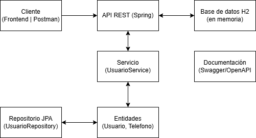
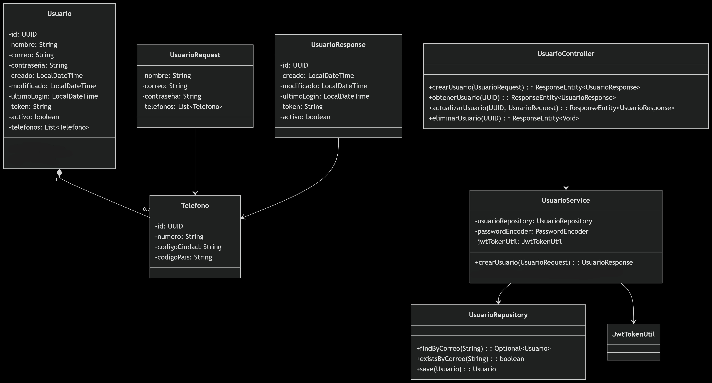

# crud-evaluacion
# Usuario API

Este proyecto es una API RESTful desarrollada en **Spring Boot 3.4.5**, que permite crear, consultar y gestionar usuarios. Usa JWT para autenticar usuarios y H2 como base de datos en memoria.

## Tecnologías usadas

- Java 17
- Spring Boot 3.4.5
- Spring Security (JWT)
- H2 Database
- Spring Data JPA
- Spring Validation
- Swagger OpenAPI 3
- JUnit 5 / Mockito

## Esquema

## ⚙️ Instalación y ejecución

1. Clona el repositorio:
- git clone https://github.com/ChrisHogni/crud-evaluacion.git
- cd crud-evaluacion

2. Compila y ejecuta
- mvn clean install
- mvn spring-boot:run

3. Accede a:
Recurso	URL

- Swagger UI	http://localhost:8080/crud-evaluacion/swagger-ui/index.html
- H2 Console	http://localhost:8080/crud-evaluacion/h2-console (JDBC Url: jdbc:h2:mem:usuariosdb | User: sa | Password: (vacío))
- API Base URL	http://localhost:8080/crud-evaluacion/usuarios

